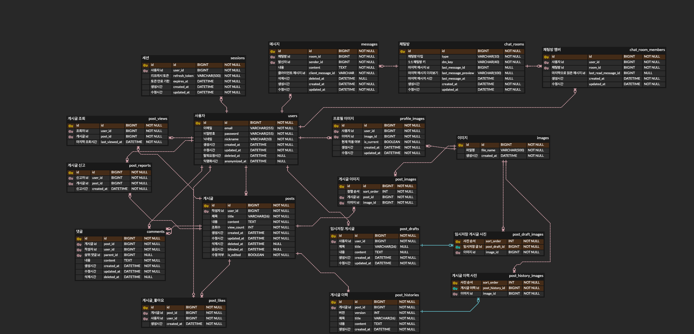
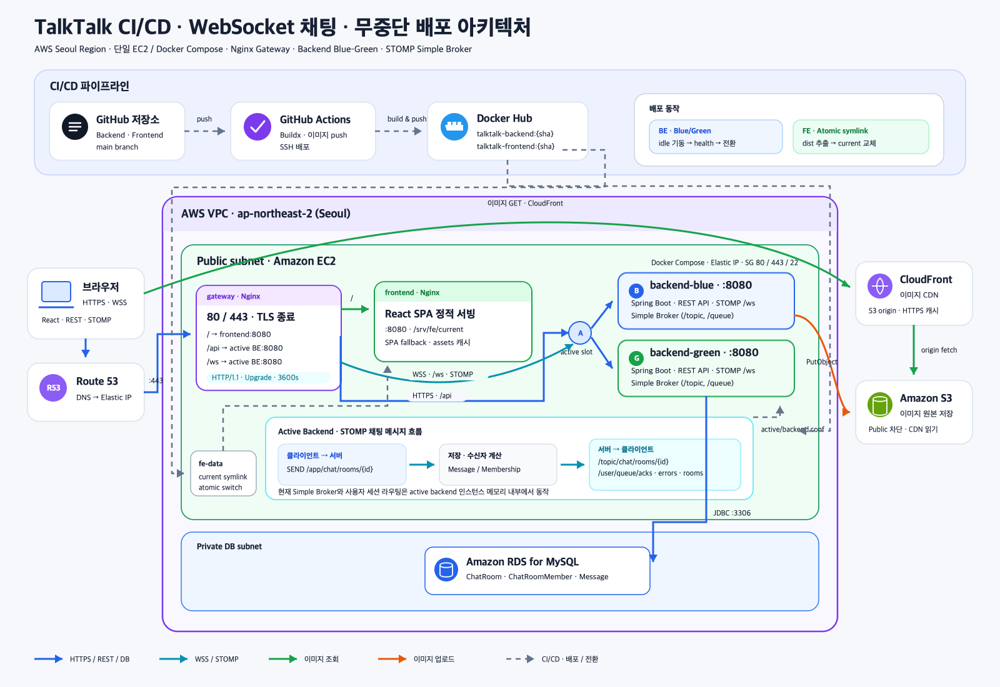

# 💬 TalkTalk

## Back-end 소개

자유로운 주제로 글을 쓰고, 댓글로 소통하며, **실시간 1:1 채팅**으로 대화하는 커뮤니티 프로젝트입니다.

- **Spring Boot 4.0 / Java 21** 로 서버를 구현하고, 운영 DB는 **MySQL**, 로컬·테스트는 **H2** 로 구성했습니다.
- 초기 프로젝트 설정부터 DB 스키마 설계, 인증(JWT + 세션), 이미지 업로드(S3), **WebSocket(STOMP) 실시간 채팅**, Docker·Nginx·GitHub Actions 를 통한 **무중단(blue/green) 배포**까지 직접 구현했습니다.
- **도메인형 패키지 구조**(`domain/*` + `global/*`)와 **Controller-Service-Repository** 계층으로 구현했습니다.
- 게시판 CRUD 는 순수 REST 로, 채팅은 **REST(방·히스토리·읽음) + STOMP over WebSocket(실시간 송수신)** 하이브리드로 설계했습니다.

## 개발 인원 및 기간

- **개발 기간** : 2026-05-26 ~ 2026-08-09
- **개발 인원** : 프론트엔드/백엔드 1명 (본인)

## 사용 기술 및 tools

| 구분 | 기술                                                                                                                  |
|---|---------------------------------------------------------------------------------------------------------------------|
| Language | Java 21                                                                                                             |
| Framework | Spring Boot 4.0, Spring Data JPA, Spring Security, Spring WebSocket(STOMP)                                          |
| Database | MySQL (운영/RDS), H2 (로컬·테스트)                                                                                         |
| Auth | JWT (jjwt) - Access Token & Refresh Token                                                                           |
| Storage | AWS S3 (이미지 저장), IAM Role 기반 인증(EC2)                                                                                |
| Infra / CI·CD | Docker, Docker Compose, Nginx(TLS 게이트웨이 · `/api` 리버스 프록시 · `/ws` 업그레이드), GitHub Actions, AWS EC2, blue/green 무중단 배포 |
| Test | JUnit5, Mockito, AssertJ, BDDMockito, JaCoCo                                                                        |

## Front-end

- **Front-end Github** : https://github.com/100-hours-a-week/KTB4_Jerry_Week7

## 서비스 시연 영상

- `<!-- 시연 영상 링크(구글 드라이브 등) 채우기 -->`

## 폴더 구조

<details>
<summary>폴더 구조 보기/숨기기</summary>

```
src/main/java/ktb/fullstack/talktalk
├── domain
│   ├── auth            # 로그인 세션 · 토큰 재발급 (JWT + Session)
│   ├── user            # 회원 CRUD · 중복 확인 · 비밀번호 변경 · 탈퇴
│   ├── post            # 게시글 · 임시저장 · 좋아요 · 신고 · 조회수 · 수정이력
│   ├── comment         # 댓글 · 대댓글(self-reference)
│   ├── chat            # 실시간 채팅 (REST + STOMP)
│   │   ├── controller  #   REST: 방/히스토리/읽음 · STOMP: @MessageMapping
│   │   ├── handler
│   │   ├── interceptor
│   │   ├── service
│   │   ├── repository
│   │   └── entity      #   ChatRoom · ChatRoomMember · Message · RoomType
│   └── image           # S3 이미지 업로드
└── global
    ├── config          # Security · Cors · WebSocket · Stomp · S3
    ├── security        # JwtFilter · UserDetails · Entry/Denied Handler
    ├── jwt             # JwtProvider · RefreshTokenGenerator
    ├── interceptor     # StompAuthChannelInterceptor (WS 인증/인가)
    ├── handler         # GlobalExceptionHandler · StompErrorHandler
    ├── resolver        # @LoginUser (인증 사용자 주입)
    ├── exception       # BusinessException · ErrorCode
    └── common          # ApiResponse · CursorPageResponse · BaseTimeEntity

deploy/                 # 배포 스크립트 · nginx 설정 · compose
.github/workflows/      # GitHub Actions CI/CD
```

</details>

## 서버 설계

### 서버 구조

도메인별로 `Controller → Service → Repository` 3계층으로 나누고, 인증·예외·응답 등 공통 관심사는 `global` 패키지로 분리했습니다.

| 도메인 | Controller | 주요 책임 |
|---|---|---|
| 인증 | `SessionController` | 로그인, Access Token 재발급, 로그아웃 |
| 유저 | `UserController` | 회원가입, 내 정보 조회/수정, 비밀번호 변경, 탈퇴, 이메일·닉네임 중복 확인 |
| 게시글 | `PostController` `PostDraftController` `PostLikeController` `PostReportController` | 게시글 CRUD, 임시저장, 좋아요, 신고 |
| 댓글 | `CommentController` | 댓글·대댓글 CRUD |
| 채팅 | `ChatRoomController` `ChatMessageController` `ChatReadController` `ChatController`(STOMP) | 방 생성/목록/조회, 메시지 히스토리·삭제, 읽음 처리, 실시간 송수신 |
| 이미지 | `ImageController` | S3 이미지 업로드 |

## 구현 기능

### Users / Auth

- 회원 CRUD 및 이메일·닉네임 **중복 확인** API 구현
- 회원가입·비밀번호 변경 시 **비밀번호를 암호화(BCrypt)** 하여 저장
- **JWT 기반 인증** — Access Token 은 `STATELESS` 로 검증하고, Refresh Token 은 `Session` 테이블에 저장해 **로그아웃(세션 무효화)** 을 서버에서 감지
- Spring Security 필터(`JwtFilter`)로 인증된 요청만 처리하고, `@LoginUser` ArgumentResolver 로 인증 사용자를 주입
- 회원 탈퇴 시 **soft delete** (`deletedAt` / `anonymizedAt`) 처리

### Posts

- 게시글 CRUD 및 **커서 기반 페이지네이션**(무한 스크롤) 구현
- 좋아요 / 신고 / 조회수 / 수정 이력 / **임시저장(draft)** 부가 기능
- 작성자·삭제(soft delete)·블라인드 상태를 엔티티에 반영

### Comments

- 댓글 CRUD 및 `parent_id` self-reference 로 **대댓글** 구현

### Chat (실시간 채팅)

- **STOMP over WebSocket** 기반 **1:1 실시간 채팅** 구현 (1:N 그룹 채팅으로 확장 가능한 구조)
- **CONNECT 1회 인증(JWT) + 프레임별 세션·멤버십 검증** 으로 인증(누구인지)과 인가/폐기(여전히 허용되나)를 분리
- **SUBSCRIBE 인가** — 방 멤버만 `/topic/chat/rooms/{id}` 구독 가능하게 막아 대화 도청 차단
- `clientMessageId` 멱등키(UNIQUE 제약)로 **재전송 중복 제거**, `last_read_message_id` 포인터로 **안읽은 수·읽음 이벤트** 처리
- `dm_key`(정규화 페어 키) UNIQUE 제약으로 **"같은 상대와 방 하나"** 를 DB 레벨에서 보장
- 채팅방 목록 실시간 갱신 이벤트 푸시, 메시지 tombstone(삭제 흔적) 지원

## 데이터베이스 설계

### 요구사항 분석

**유저 관리**
- 이메일·비밀번호·닉네임을 포함하는 유저 관리
- 이메일·닉네임은 UNIQUE 로 중복 방지, 탈퇴는 soft delete 로 이력 보존

**게시글 관리**
- 제목·내용·조회수·작성/수정일시 등을 포함하는 게시글을 관리하고 작성자(User)를 참조
- 좋아요·신고·조회·수정이력·임시저장을 별도 테이블로 분리

**댓글 관리**
- 내용·작성자·작성일시를 포함하고, 어떤 게시글에 속하는지(post_id)와 부모 댓글(parent_id)을 참조

**세션 관리**
- 로그인 세션(Refresh Token·만료시간)을 저장해 토큰 재발급·로그아웃 감지

**채팅 관리**
- 채팅방(ChatRoom)·방 멤버(ChatRoomMember)·메시지(Message)를 관리
- 메시지 전역 auto-increment PK 를 방 내 정렬·커서·읽음 비교의 기준으로 사용

### 모델링 — E-R Diagram

요구사항과 삭제 정책(CASCADE / RESTRICT / SET NULL)을 반영해 모델링한 전체 ER 다이어그램입니다.



## 배포 아키텍처

`main` 브랜치 push → GitHub Actions 가 이미지를 빌드해 Docker Hub 에 push → EC2 로 배포 스크립트를 전송·실행하여 **blue/green 무중단 배포**를 수행합니다. Nginx 게이트웨이가 TLS 종료 · `/api` 리버스 프록시 · `/ws` WebSocket 업그레이드를 담당합니다.



## 트러블 슈팅

### 1. JPA 세션 오염 — 예외를 잡아도 되살아나지 않는 트랜잭션

**증상** — "같은 상대와는 DM 방 하나"를 `dm_key` UNIQUE 로 보장하고, 동시 생성 경합의 패자는 UNIQUE 위반(`DataIntegrityViolationException`)을 `catch` 해서 기존 방을 재조회하도록 구현했습니다. 단위 테스트(Mock)는 통과했지만, 실제 DB 로 경합을 재현하니 재조회 지점에서 예외가 터졌습니다.

```
org.hibernate.AssertionFailure: Entry for instance of 'ChatRoom' has a null identifier
  (this can happen if the session is flushed after an exception occurs)
```

**원인** — 자바 예외를 `catch` 로 잡는 것과 오염된 JPA(Hibernate) 세션을 되살리는 것은 별개의 문제였습니다.
1. UNIQUE 위반 발생 → 트랜잭션에 rollback-only 표시가 찍히고, 세션에는 저장 실패한 `ChatRoom(id=null)` 유령 엔티티가 남음
2. `catch` 안의 `findByDmKey` 가 조회 전 자동 flush 를 유발
3. flush 가 id 가 null 인 유령 엔티티를 밀어내려다 `AssertionFailure`

Mock 테스트에는 진짜 트랜잭션도 세션도 없어서 "예외를 잡으면 재조회한다"는 호출 흐름만 흉내 냈을 뿐, 세션 오염을 재현하지 못했던 것입니다.

**해결** — 트랜잭션이 필요한 **생성**만 별도 빈(`ChatRoomCreator`)의 `@Transactional` 로 격리하고, **경합 복구**를 감싸는 바깥에는 트랜잭션을 걸지 않았습니다. (바깥에 `@Transactional` 을 붙이면 생성이 기본 전파 `REQUIRED` 로 합류해 격리가 사라집니다.) 같은 클래스 내부 호출은 프록시를 거치지 않는 self-invocation 이 되므로 반드시 별도 빈으로 분리했습니다.

```java
// 바깥: 트랜잭션 없음 — 오염될 트랜잭션 자체가 없다
private ChatRoom createOrRecover(String dmKey, Long requesterId, Long partnerId) {
    try {
        return chatRoomCreator.create(dmKey, requesterId, partnerId); // 별도 빈 → 프록시 경유
    } catch (DataIntegrityViolationException race) {
        return chatRoomRepository.findByDmKey(dmKey).orElseThrow(() -> race);
    }
}
```

### 2. N+1 — 게시글 목록 조회 41회 쿼리를 5회로

**증상** — 게시글 목록을 10개 가져오는 데 41회의 쿼리가 나갔습니다. 목록을 받은 뒤 글마다 요약 DTO 로 변환하면서, 글 하나당 **작성자·프로필 이미지·좋아요 수·댓글 수** 를 건by건으로 조회하고 있었습니다. JPA 로 마이그레이션하면 자연히 해결될 거라 막연히 기대했지만, 루프 안에서 매번 레포지토리를 호출하는 구조라 호출 횟수만큼 쿼리가 나가는 문제는 동일했습니다.

**원인** — 데이터를 "필요할 때 하나씩" 가져오는 접근. `1(목록) + 10×4(글별 조회) = 41회`.

**해결** — 루프에 들어가기 전에 필요한 데이터를 **한 번에** 가져와 `Map` 으로 조립했습니다.
- 작성자 → `userId IN (...)` 로 일괄 조회
- 프로필 이미지 → Lazy 로딩 대신 `join fetch` 로 한 번에
- 좋아요 수 / 댓글 수 → `WHERE post_id IN (...) GROUP BY post_id` 로 글별 개수 일괄 집계

`show-sql` 로 확인하니 **41회 → 5회** 로 줄었습니다. (댓글·대댓글 조회에도 동일한 N+1 이 남아 있어 후속 개선 대상으로 두고 있습니다.)

### 3. 로컬에서만 되던 WebSocket — nginx 핸드셰이크 프록시

**증상** — 로컬에서는 프론트엔드가 백엔드 `/ws` 에 직접 연결돼 정상 동작했지만, 프로덕션에서는 WebSocket 연결이 실패했습니다. 같은 백엔드를 향하고 REST API 는 잘 되므로 WebSocket 도 별도 설정 없이 전달될 거라 생각했습니다.

**원인** — WebSocket 은 최초 요청에서 HTTP 를 WebSocket 으로 전환하는 핸드셰이크가 필요한데, 이때 쓰이는 `Upgrade`·`Connection` 헤더는 **hop-by-hop 헤더**라 nginx 가 백엔드로 자동 전달하지 않았습니다. `proxy_http_version 1.1` 만으로는 부족했습니다.

**해결** — 게이트웨이 nginx 에 `/ws` 전용 location 을 두고 업그레이드 헤더를 명시적으로 전달했습니다. 아울러 `StompConfig` 엔드포인트의 허용 Origin 에 프로덕션 도메인을 추가했습니다.

```nginx
map $http_upgrade $connection_upgrade { default upgrade; '' close; }

location ^~ /ws {
    proxy_pass http://$backend_host:8080;
    proxy_http_version 1.1;
    proxy_set_header Upgrade    $http_upgrade;
    proxy_set_header Connection $connection_upgrade;
    proxy_read_timeout 3600s;
    proxy_send_timeout 3600s;
}
```

## 프로젝트 후기

이 프로젝트는 한 주 한 주 배운 내용을 **한 층씩 쌓아 올린 기록**입니다. REST API 명세 설계에서 시작해 Spring Boot로 구현하고, 저장소를 일부러 CSV 로 다뤄본 뒤 JPA 로 옮기고, ERD와 삭제 정책을 다시 세우고, 인증을 인터셉터에서 Spring Security 필터체인으로 마이그레이션하고, Docker·AWS 로 배포한 다음, 마지막에 CI/CD·무중단 배포와 실시간 채팅을 얹었습니다. 매 단계가 "돌아가는 결과물 + 새 개념 하나 + 다음을 부르는 한계" 였고, 그 한계가 다음 주의 동기가 되어주었습니다.

가장 크게 남은 배움은 **"이 규모에서 이 기술이 정말 필요한가"와 "이 기술적 선택이 어떤 트레이드오프를 가지며 다른 대안들보다 나은 점은 무엇인가"를 스스로 되묻는 분별력** 이었습니다. 기술을 먼저 정해놓고 이유를 끼워 맞추지 않으려 했고, 편의보다 근거 있는 선택을 우선하려 했습니다. `dm_key` 로 DM 유일성을 보장하며 FK 기반의 강한 참조 무결성을 일부 포기한 대신 멤버십 모델의 중복을 피한 선택, 채팅방 목록의 마지막 메시지를 비정규화해 읽기 비용을 줄이는 대신 쓰기·삭제 정합성을 직접 관리하기로 한 판단, ACK·에러를 방 토픽이 아니라 발신자 개인 큐로 분리해 전송량 증가를 감수하고 관심사를 명확히 나눈 결정이 그런 고민의 결과입니다.

**테스트를 구현과 함께 작성하는 것**의 가치도 크게 느꼈습니다. 프로덕션 코드를 다 짠 뒤 테스트를 붙이던 때에는 분기 흐름이 잘 떠오르지 않고 테스트가 내 코드를 뒤따라가기만 했는데, 각 단계를 구현하면서 바로 테스트를 세우니 요구사항을 검증하기 수월했습니다. 특히 "테스트가 통과해도 놓치는 문제"(트러블 슈팅 1번의 트랜잭션 오염)를 마주하면서, 라인 커버리지를 올리는 것보다 **어떤 예외 상황이 발생할 수 있는지 짚어내 테스트 케이스로 골라내는 역량**이 더 중요하다는 것을 배웠습니다. `@DisplayName` 으로 검증할 상황을 먼저 적어두면 테스트가 요구사항을 구체화하고 문서화하는 역할까지 한다는 것도 느꼈습니다.

채팅의 주요 기능은 구현했지만, 운영 규모가 커졌을 때를 위한 고도화는 아직 남아 있습니다. 개인 프로젝트 기간이 끝나더라도 관계형 DB 에 쌓이는 채팅 데이터를 **NoSQL 로 전환**하는 방안과, 여러 컨테이너·인스턴스에 걸쳐 메시지를 전달하기 위한 **Redis Pub/Sub 외부 브로커** 적용을 이어가려 합니다. 앞으로도 개념을 이해하고, 검증하고, 기록하는 흐름을 유지하며 채워나가고 싶습니다.
